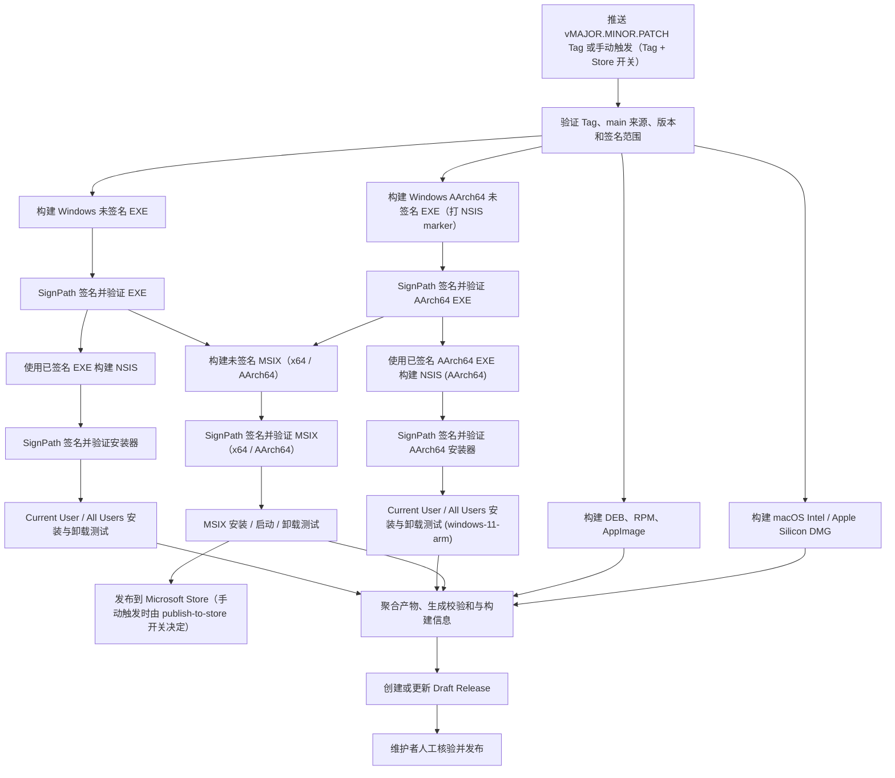

# Release 发布流程

本文档面向花笺维护者，说明 [Release Workflow](../.github/workflows/release.yml) 的配置、触发方式、构建与签名链路、验证规则以及失败后的处理方式。

该 Workflow 负责生成经过验证的多平台发布产物，并创建或更新 GitHub Draft Release。它不会自动把 Draft Release 发布为正式 Release。

## 流程概览

Release Workflow 由以下两种方式触发：

- **Tag Push**：格式为 `vMAJOR.MINOR.PATCH` 的 Tag 推送，例如 `v1.2.3`；
- **手动触发（`workflow_dispatch`）**：必须填写 Tag（`vMAJOR.MINOR.PATCH`）并选择是否发布到 Microsoft Store（`publish-to-store`，默认 `false`）。



同一个 Tag 的运行通过 Workflow concurrency group 串行化。新运行不会取消正在执行的发布运行。

## 发布权限和外部配置

### GitHub Environment

仓库存在名为 `release-signing` 的 GitHub Environment，作为签名 Job 的人工审批门（建议配置 Required reviewers 并禁止发起者自审）。签名凭据本身存放在**仓库级 Secrets 和 Variables**（见下节），不依赖 Environment 提供凭据。

Store 发布凭据同样存放在仓库级（全局），不依赖 Environment：

| 类型   | 名称                           | 用途                              |
| ------ | ------------------------------ | --------------------------------- |
| Secret | `PARTNER_CENTER_TENANT_ID`     | msstore CLI 的 Entra ID Tenant ID |
| Secret | `PARTNER_CENTER_SELLER_ID`     | Partner Center Seller ID          |
| Secret | `PARTNER_CENTER_CLIENT_ID`     | Entra ID 应用注册 Client ID       |
| Secret | `PARTNER_CENTER_CLIENT_SECRET` | Entra ID 应用注册 Client Secret   |

### 仓库级 Secrets 和 Variables

所有 SignPath 配置均存放在仓库级（全局），被构建/验证/发布 Job 共享：

| 类型     | 名称                                                           | 用途                                                                                                             |
| -------- | -------------------------------------------------------------- | ---------------------------------------------------------------------------------------------------------------- |
| Secret   | `SIGNPATH_API_TOKEN`                                           | 提交正式 SignPath 签名请求                                                                                       |
| Variable | `SIGNPATH_ORGANIZATION_ID`                                     | SignPath Organization ID                                                                                         |
| Variable | `SIGNPATH_PROJECT_SLUG`                                        | SignPath Project Slug                                                                                            |
| Variable | `SIGNPATH_WINDOWS_BINARY_ARTIFACT_CONFIGURATION_SLUG`          | Windows 主程序签名配置                                                                                           |
| Variable | `SIGNPATH_WINDOWS_BINARY_ARM64_ARTIFACT_CONFIGURATION_SLUG`    | Windows AArch64 主程序签名配置                                                                                   |
| Variable | `SIGNPATH_WINDOWS_INSTALLER_ARTIFACT_CONFIGURATION_SLUG`       | Windows 安装器签名配置                                                                                           |
| Variable | `SIGNPATH_WINDOWS_INSTALLER_ARM64_ARTIFACT_CONFIGURATION_SLUG` | Windows AArch64 安装器签名配置                                                                                   |
| Variable | `SIGNPATH_WINDOWS_MSIX_ARTIFACT_CONFIGURATION_SLUG`            | MSIX 包签名配置（`<msix-file>` root，SHA-256）                                                                   |
| Variable | `SIGNPATH_CERTIFICATE_SUBJECT`                                 | 正式证书 Subject 固定值                                                                                          |
| Variable | `SIGNPATH_CERTIFICATE_ISSUER`                                  | 正式证书 Issuer 固定值                                                                                           |
| Variable | `SIGNPATH_CERTIFICATE_SHA1`                                    | 正式证书 SHA-1 指纹                                                                                              |
| Variable | `MSIX_IDENTITY_NAME`                                           | MSIX 清单 Identity Name，必须等于 Partner Center 保留名称                                                        |
| Variable | `MSIX_PUBLISHER_CN`                                            | MSIX 清单 Publisher（证书 Subject CN），必须与账户 Publisher 匹配                                                |
| Variable | `MSIX_PUBLISHER_DISPLAY_NAME`                                  | MSIX 清单 PublisherDisplayName                                                                                   |
| Variable | `MSSTORE_APP_ID`                                               | Partner Center 产品 ID（`msstore publish -id` 使用）                                                             |
| Variable | `MSSTORE_PUBLISH_ENABLED`                                      | Store 发布总开关；置 `false` 时跳过 `publish-msix-store`                                                         |
| Variable | `MSIX_ARM64_RUNTIME_TEST`                                      | AArch64 运行时测试总开关；置 `false` 时 AArch64 MSIX 与 AArch64 NSIS 均跳过运行时安装测试（签名/结构验证仍执行） |

Workflow 固定使用 SignPath policy slug `release-signing`，不会从变量动态选择测试策略。

建议在 SignPath 中同时启用：

- Trusted Build System；
- Origin Verification；
- 正式签名人工审批；
- 仓库、Workflow、Tag 和 Commit 来源限制；
- 禁止 rerun 或其他不符合项目发布规则的来源。

### Tag 保护

GitHub 应为 `v*` 配置 Tag ruleset，限制 Tag 的创建、更新、删除和强制推送权限。

Workflow 自身还会在以下时间点读取远端 Tag：

1. 初始发布验证；
2. Windows 主程序（x64 / AArch64）签名前；
3. Windows 安装器（x64 / AArch64）签名前；
4. 创建或更新 Draft Release 前。

每次检查都要求：

- Tag 仍然存在；
- Tag 仍指向最初触发 Workflow 的 Commit；
- 该 Commit 仍属于远端 `main` 的历史。

只要 Tag 被删除、移动，或 Commit 不再属于 `main`，后续签名或发布就会停止。

## 发布前准备

### 1. 确认代码状态

发布 Commit 必须已经合入 `main`，并通过完整 PR Checks。建议从最新的 `main` Head 发布。

```bash
git switch main
git pull --ff-only origin main
```

### 2. 同步版本号

以下三处版本必须完全一致：

- `package.json` 的 `version`；
- `src-tauri/tauri.conf.json` 的 `version`；
- `src-tauri/Cargo.toml` 的 package `version`。

可以使用项目脚本同步版本：

```bash
npm run version:sync -- 1.2.3
npm install --package-lock-only --ignore-scripts
cargo check --manifest-path src-tauri/Cargo.toml
```

后两条命令用于同步 `package-lock.json` 和 `src-tauri/Cargo.lock`。执行后应检查 `package.json`、`package-lock.json`、Tauri 配置和 Cargo 文件的实际差异。

### 3. 编写 Release Note

为新版本创建：

```text
Docs/release-note/1.2.3.md
```

文件名不包含 `v`。缺少对应 Release Note 时，Workflow 会在构建前失败。

### 4. 执行发布前检查

```bash
cargo test --manifest-path src-tauri/Cargo.toml -p floral-notepaper --lib
npm test
cargo clippy --manifest-path src-tauri/Cargo.toml --all-targets
npm run lint
npm run fmt -- --check
cargo fmt --manifest-path src-tauri/Cargo.toml -- --check
```

全部通过后再合入版本变更。不要用 Release Workflow 替代 PR Checks。

### 5. 创建并推送 Tag（或手动触发）

先确认本地 `main` 和远端一致，再在目标 Commit 上创建 annotated Tag：

```bash
git tag -a v1.2.3 -m "release: v1.2.3"
git push origin v1.2.3
```

Tag 名必须严格匹配 `vMAJOR.MINOR.PATCH`。预发布后缀、构建元数据和其他格式不会通过验证。

Tag 推送后不要移动或复用该 Tag。若发现需要修复的问题，应修复代码并发布新的补丁版本，而不是把原 Tag 指向另一个 Commit。

也可以手动触发 Workflow（Actions → Release → Run workflow）：

- **Tag**（必填）：输入 `vMAJOR.MINOR.PATCH`，必须对应远端已存在、指向 `main` 历史中某个 Commit 的 Tag；
- **是否发布到 Microsoft Store**（必选，默认 `false`）：控制 `publish-msix-store` 是否执行；Tag Push 触发时此开关不生效，改由仓库变量 `MSSTORE_PUBLISH_ENABLED` 控制。

手动触发与 Tag Push 共用同一套验证（Tag 存在性、指向 `main`、版本一致、Release Note、签名范围），构建代码与验证均以输入的 Tag 为准。

## Workflow Job 说明

| Job                                         | 主要职责                                                                                                                                        |
| ------------------------------------------- | ----------------------------------------------------------------------------------------------------------------------------------------------- |
| `validate-release`                          | 验证 Tag 来源、版本、Release Note、Rust binary target、Tauri bundle 签名范围和安装模式                                                          |
| `build-windows-binary`                      | 构建未签名 Windows 主程序，并在签名前写入 Tauri NSIS bundle marker                                                                              |
| `sign-windows-binary`                       | 重新验证 Tag，提交正式 SignPath 签名请求，验证签名、时间戳和正式证书固定值                                                                      |
| `build-windows-installer`                   | 恢复已签名主程序，验证其哈希，构建未签名 NSIS 安装器                                                                                            |
| `sign-and-verify-windows-installer`         | 签名安装器，验证 portable EXE 和安装器，执行两种安装模式的安装与卸载测试                                                                        |
| `build-windows-binary-aarch64`              | 交叉构建未签名 Windows AArch64 主程序，并在签名前写入 Tauri NSIS bundle marker（同时供 NSIS 与 MSIX）                                           |
| `sign-windows-binary-aarch64`               | 签名并验证 Windows AArch64 主程序（含 marker 保留校验）                                                                                         |
| `build-windows-installer-aarch64`           | 恢复已签名 AArch64 主程序，验证其哈希，构建未签名 AArch64 NSIS 安装器                                                                           |
| `sign-and-verify-windows-installer-aarch64` | 签名 AArch64 安装器，验证签名，在 `windows-11-arm` 上执行两种安装模式的安装与卸载测试（由 `MSIX_ARM64_RUNTIME_TEST` 门控）                      |
| `build-windows-msix`                        | 恢复各架构已签名主程序，用 `scripts/build-msix.ps1` 构建未签名 MSIX（x64 / AArch64）                                                            |
| `sign-windows-msix`                         | 签名并验证 MSIX 包、清单身份和嵌入主程序                                                                                                        |
| `verify-windows-msix-install`               | `Add-AppxPackage` 安装、启动、单实例、卸载测试（AArch64 使用 Windows AArch64 runner）                                                           |
| `publish-msix-store`                        | 合并双架构 MSIX 为 `.msixupload`，用 msstore CLI 提交（Tag Push 时由 `MSSTORE_PUBLISH_ENABLED` 控制；手动触发时由 `publish-to-store` 输入决定） |
| `build-linux`                               | 构建并强制收集恰好一个 DEB、RPM 和 AppImage                                                                                                     |
| `build-macos-x86_64`                        | 构建 Intel DMG                                                                                                                                  |
| `build-macos-aarch64`                       | 构建 Apple Silicon DMG                                                                                                                          |
| `publish-draft-release`                     | 聚合全部产物，生成 `SHA256SUMS.txt` 和 `BUILD-INFO.txt`，创建或更新 Draft Release                                                               |

发布构建统一使用固定的 Rust `1.96.1` 工具链，避免相同 Tag 在不同时间使用不同的 `stable` 编译器。

## Windows 签名和安装验证

### 主程序签名

Windows 主程序（x64 与 AArch64）在 SignPath 签名前都会把 Tauri bundle type marker 从 `UNK` 改为 `NSS`。AArch64 二进制与 x64 一样同时供 NSIS 安装器与 MSIX 包使用，因此同样需要该 marker。Workflow 要求：

- `UNK` marker 在修改前恰好出现一次；
- `NSS` marker 在修改前不存在；
- 两个 marker 长度一致；
- 修改后只保留一个 `NSS` marker；
- SignPath 返回的文件必须使用配置的正式证书；
- Authenticode 状态必须为 `Valid`；
- 必须包含时间戳；
- `signtool verify /pa /all /v` 必须通过；
- 签名后的二进制仍必须恰好含一个 `NSS` marker 且不含 `UNK`（防止签名过程丢失 marker）。

测试证书和不受信任根证书不会被 Release Workflow 接受。

### NSIS 构建

NSIS 打包前，Workflow 会记录已签名主程序的 SHA-256。打包后再次读取主程序文件，确保 bundler 没有替换或修改已签名文件。

x64 与 AArch64 的差异仅在目标路径与 bundle 参数：

- x64：`src-tauri/target/release/`，`tauri bundle --bundles nsis`，产物 `floral-notepaper_<v>_x64-setup.exe`；
- AArch64：`src-tauri/target/aarch64-pc-windows-msvc/release/`，`tauri bundle --target aarch64-pc-windows-msvc --bundles nsis`，产物 `floral-notepaper_<v>_arm64-setup.exe`。

### 安装测试

x64 安装器在 `windows-latest` 上测试；AArch64 安装器在 `windows-11-arm` 上测试（NSIS 安装器本体为 x86-unicode stub，经 Windows on ARM 仿真运行），并受 `MSIX_ARM64_RUNTIME_TEST` 门控（置 `false` 时跳过运行时测试，签名与结构验证仍执行）。

由于 `tauri.conf.json` 声明 `installMode: both`，CI 会依次测试：

- `/S /CurrentUser`；
- `/S /AllUsers`。

每种模式都会验证：

- 安装器和 portable EXE 的正式签名；
- 安装后主程序的正式签名；
- 安装后主程序与 portable EXE 的 SHA-256 一致；
- 安装目录中的实际 PE 文件只包含主程序和已知卸载器；
- 卸载器是合法 PE，并记录 SHA-256；
- 卸载成功后主程序、安装目录和卸载注册表项均已删除。

### 卸载器签名例外

当前 Tauri/NSIS 流程在安装期间生成 `uninstall.exe`。在 SignPath Artifact Configuration 支持该嵌套产物的 deep signing 前，Workflow 明确允许卸载器状态为 `NotSigned`，并把它作为已知发布例外记录到 Job Summary。

如果卸载器带有签名，则该签名必须使用同一正式证书并通过完整验证。任何无效、损坏或其他异常签名状态都会使发布失败。

该例外不表示风险已经消除。正式启用卸载器 deep signing 后，应删除 `NotSigned` 例外并强制要求有效签名。

## 发布产物

Workflow 要求以下十个产物全部存在：

| 平台                 | 文件名                                     |
| -------------------- | ------------------------------------------ |
| Windows portable     | `floral-notepaper_VERSION.exe`             |
| Windows NSIS x64     | `floral-notepaper_VERSION_x64-setup.exe`   |
| Windows NSIS AArch64 | `floral-notepaper_VERSION_arm64-setup.exe` |
| Windows MSIX x64     | `floral-notepaper_VERSION_x64.msix`        |
| Windows MSIX AArch64 | `floral-notepaper_VERSION_arm64.msix`      |
| Linux DEB            | `floral-notepaper_VERSION_amd64.deb`       |
| Linux RPM            | `floral-notepaper-VERSION-1.x86_64.rpm`    |
| Linux AppImage       | `floral-notepaper_VERSION_amd64.AppImage`  |
| macOS Intel          | `floral-notepaper_VERSION_x64.dmg`         |
| macOS Apple Silicon  | `floral-notepaper_VERSION_aarch64.dmg`     |

其中 `VERSION` 是不带 `v` 的版本号。

此外还会生成：

- `SHA256SUMS.txt`：全部发布文件的 SHA-256；
- `BUILD-INFO.txt`：Tag、Commit SHA、GitHub Actions Run ID 和 Run Attempt。

## MSIX 构建、签名与验证

### 打包

Tauri bundler 不生成 MSIX。`build-windows-msix` 使用 `scripts/build-msix.ps1` 从已签名主程序构建 MSIX：

- 从 `src-tauri/msix/AppxManifest.template.xml` 渲染清单（版本转四段 `X.Y.Z.0`；`ProcessorArchitecture` 为 `x64` 或 `AArch64`；`Identity Name` / `Publisher` 来自仓库级 Variables）；
- 清单声明 `desktop6:RegistryWriteVirtualization` / `desktop6:FileSystemWriteVirtualization` 为 `disabled`，并声明 `rescap:Capability Name="unvirtualizedResources"`，使托盘自启动（HKCU Run 键）与 `%APPDATA%\floral-notepaper` 配置写入不被 MSIX 虚拟化；
- 用 `MakeAppx.exe` 打包，随后 `makeappx unpack` 回验清单身份、版本、架构与内嵌主程序哈希。

### 签名

MSIX 由 SignPath 使用 `SIGNPATH_WINDOWS_MSIX_ARTIFACT_CONFIGURATION_SLUG` 配置（`<msix-file>` root，SHA-256）签名。签名后验证：

- 包签名使用固定正式证书，`Valid` 且包含时间戳；
- `signtool verify /pa /all` 通过；
- 清单身份、Publisher、四段版本、处理器架构与发布版本一致；
- 内嵌主程序哈希与签名前一致；若 SignPath 对嵌入文件执行了 deep signing 导致哈希变化，则要求嵌入文件仍携带同一固定证书的有效签名（记录新哈希）。

### 安装测试

`verify-windows-msix-install` 对每个架构执行：

- `Add-AppxPackage` 安装（证书为公开受信证书，无需预装；失败不静默放宽）；
- `Get-AppxPackage` 断言版本与 `SignatureKind`；
- 从安装目录启动主程序：进程存活或至少创建非虚拟化的 `%APPDATA%\floral-notepaper` 配置目录（CI 无桌面会话，WebView 渲染列入人工核验）；
- 第一实例存活时启动第二实例，断言单实例转发（第二实例自行退出）；
- `Remove-AppxPackage` 卸载并断言注册清除。

AArch64 包无法在 x64 主机安装，安装测试使用 GitHub Windows AArch64 runner（`windows-11-arm`）。若组织暂时无法使用该 runner，可将仓库变量 `MSIX_ARM64_RUNTIME_TEST` 置为 `false` 跳过 AArch64 运行时步骤（签名与结构验证仍执行），运行时行为交由 Store 认证与人工 ARM 设备核验。该变量同时门控 AArch64 NSIS 安装器的运行时安装测试（见上文「安装测试」节）。

### 发布到 Microsoft Store

`publish-msix-store` 在 `MSSTORE_PUBLISH_ENABLED != 'false'` 时直接执行（无 Environment 审批门）：

- 复验两个架构 MSIX 的签名与清单；
- 用 `scripts/build-msixupload.ps1` 合并为 `.msixupload`（zip 容器，内含两个已签名 MSIX，容器本身不签名）；
- 用官方 `msstore` CLI（`microsoft/microsoft-store-apppublisher`）提交 submission 并轮询状态。

注意：

- msstore CLI 仅支持免费产品的更新操作；
- **首个 submission 不支持经 CLI 创建**，必须在 Partner Center 人工完成（含上架资料），之后版本更新可全自动；
- 每次 Tag 都会提交新 submission；不想发布某版本时置 `MSSTORE_PUBLISH_ENABLED=false`（该 Job 直接跳过，不影响其他 Job）；
- 提交后若发现问题，可在认证完成前于 Partner Center 取消该 submission。

## Draft Release 行为

如果 Tag 尚无 GitHub Release，Workflow 会创建 Draft Release；如果已存在同 Tag 的 Draft Release，则更新标题和 Release Note，并使用 `gh release upload --clobber` 覆盖本 Workflow 管理的同名文件。

Workflow 不会：

- 覆盖已经发布的非 Draft Release；
- 删除名称未知的 Release 附件；
- 自动把 Draft 标记为正式发布。

维护者应在 GitHub 页面人工核验：

1. 十个预期平台产物全部存在；
2. `SHA256SUMS.txt` 与实际附件一致；
3. `BUILD-INFO.txt` 中的 Commit 是预期发布 Commit；
4. Windows 文件的 Publisher 和签名状态正确；
5. Release Note 内容及版本正确；
6. 对应 PR Checks 和 Release Workflow 全部成功。

确认无误后再手动发布 Draft Release。

## Store 发布顺序建议

`publish-msix-store` 与 `publish-draft-release` 并行执行，两者互不依赖。由于发布 Job 无 Environment 审批门，推荐用 `MSSTORE_PUBLISH_ENABLED` 控制节奏：

1. **Tag Push 触发时**：发布前若暂不想提交 Store，先将 `MSSTORE_PUBLISH_ENABLED` 置 `false`；等待 `verify-windows-msix-install` 与 `publish-draft-release` 完成，核验 Draft Release 的 MSIX 资产与安装测试摘要后，将变量置回 `true` 并重跑 Store 发布 Job（或直接接受已自动提交的结果）；
2. **手动触发时**：在 Run workflow 对话框的「是否发布到 Microsoft Store」下拉中选择 `false` 即可只构建不发布；确认无误后再手动触发一次（选择 `true`）或直接在 Partner Center 操作；
3. 在 Partner Center 跟踪认证状态；认证期间发现问题可取消 submission。

## 失败处理

### Tag 来源验证失败

常见原因：

- Tag 指向尚未合入 `main` 的 Commit；
- Tag 在运行期间被删除或移动；
- 本次运行来自不支持的 Ref；
- Tag 名不是稳定 SemVer 格式；
- 手动触发时输入的 Tag 不存在或不是 `vMAJOR.MINOR.PATCH` 格式。

不要通过移动原 Tag 绕过检查。应修复来源问题，并在需要时使用新的补丁版本。

### 版本或 Release Note 验证失败

检查三处版本号与 `Docs/release-note/VERSION.md`。修复后通过 PR 合入 `main`，再创建新 Tag。

### SignPath 请求失败

依次确认：

- `release-signing` Environment 是否批准；
- `SIGNPATH_API_TOKEN` 是否有效；
- SignPath project 和 artifact configuration slug 是否正确；
- `release-signing` policy 是否允许本仓库、Workflow、Tag 和 Commit；
- Origin Verification 是否给出明确拒绝原因；
- 正式证书固定值是否与 SignPath 实际证书一致。

不要把 Release Workflow 临时改回测试 policy，也不要放宽正式证书验证以使构建通过。

### Linux 或 macOS 产物数量错误

Workflow 要求每种格式恰好一个候选文件。零个候选通常表示 bundler 未生成目标格式；多个候选通常表示输出目录包含旧文件或 Tauri 输出结构发生变化。

应修正构建或收集逻辑，不要改成任意选择第一个文件。

### Windows 安装测试失败

根据失败阶段检查：

- portable EXE 与安装后文件的 SHA-256；
- Authenticode 和时间戳状态；
- Current User 与 All Users 对应的卸载注册表位置；
- 安装目录中的额外 PE 文件；
- 卸载后的目录、文件和注册表残留；
- NSIS hook 或 Tauri installer 行为是否发生变化。

AArch64 安装器测试还额外关注：

- `windows-11-arm` runner 是否可用；无 runner 时按文档置 `MSIX_ARM64_RUNTIME_TEST=false` 降级（签名与结构验证仍执行）；
- runner 镜像是否包含 Windows SDK 的 `x64\signtool.exe`（`signtool verify` 依赖它，缺失时应 fail-closed 报错而非放宽）；
- NSIS 安装器本体为 x86-unicode stub，在 AArch64 上经仿真运行，行为差异不应通过修改测试逻辑规避。

### MSIX 构建或签名失败

- `build-windows-msix`：检查 `scripts/build-msix.ps1` 的 unpack 回验输出（清单身份/版本/架构、内嵌主程序哈希）；确认 `MSIX_IDENTITY_NAME`、`MSIX_PUBLISHER_CN` 等仓库变量已配置。
- `sign-windows-msix`：确认 SignPath MSIX artifact configuration（`<msix-file>` root）已创建且 slug 正确；证书固定值是否与 SignPath 实际证书一致；deep signing 导致的哈希变化必须伴随有效固定证书签名。
- `verify-windows-msix-install`：AArch64 需要 `windows-11-arm` runner 可用；无 runner 时按文档置 `MSIX_ARM64_RUNTIME_TEST=false` 降级；证书不受信时明确失败（不静默放宽）。

### Store 发布失败

- `msstore publish` 失败：检查仓库级 `PARTNER_CENTER_*` 凭据（Entra ID 应用注册、Seller ID、Product ID）；确认产品为免费产品且已存在至少一个历史 submission（CLI 不支持首提交）；确认新版本高于 Store 已提交版本（Store 拒绝降级）。
- 不想发布当前版本：置 `MSSTORE_PUBLISH_ENABLED=false` 后重跑。
- 提交成功但认证失败：在 Partner Center 查看认证报告，修复后发布新的补丁版本。

### 重试原则

同 Tag 的运行不会并发执行。只有在确认 Tag 没有移动、代码和配置没有变化，且失败属于临时基础设施问题时，才适合重新运行失败 Job。

若修复需要修改仓库内容，应通过新 Commit 和新版本 Tag 发布，不应让同一 Tag 对应不同源码或不同 Workflow。

## 维护要求

修改以下内容时，应同步更新本文档：

- `.github/workflows/release.yml` 的触发条件、Job 或权限；
- SignPath policy、artifact configuration、证书或变量命名；
- Tauri bundle target 或 Windows `installMode`；
- MSIX 清单模板（`src-tauri/msix/AppxManifest.template.xml`）或打包脚本（`scripts/build-msix.ps1`、`scripts/build-msixupload.ps1`）；
- Microsoft Store 产品身份（保留名称、Publisher）或发布凭据；
- 发布产物名称、平台或架构；
- Draft Release 创建、覆盖或校验清单行为；
- Rust 发布工具链版本；
- 卸载器签名例外。

对 Release Workflow 的变更应经过安全审查，并由 CODEOWNERS 保护 Workflow 和 SignPath policy 文件。
